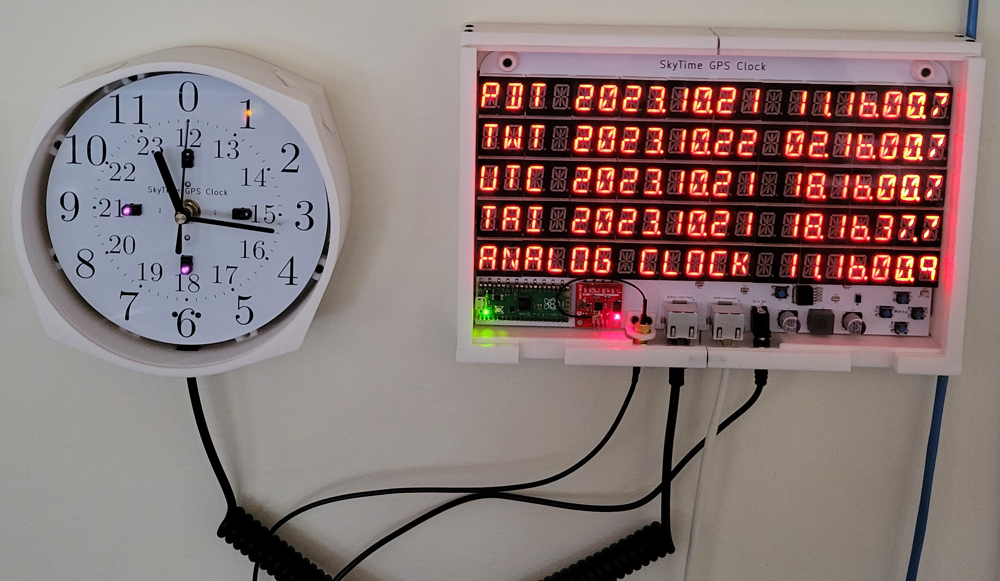

GPS Clock
---------

This is the firmware for a wall clock based on a Raspberry Pi Pico and a u-blox ZOE-M8Q GPS.
You can see the schematics for the clock in the schematics/ directory. The hardware is a
one-off that includes various obsolete and otherwise sketchy parts that were easily available
to me, so it would be difficult for you to reproduce the board. As such, this firmware is
probably not useful to you as a complete package, but somebody did express interest in
seeing it for educational purposes, so here you go. I hope you learn something.

